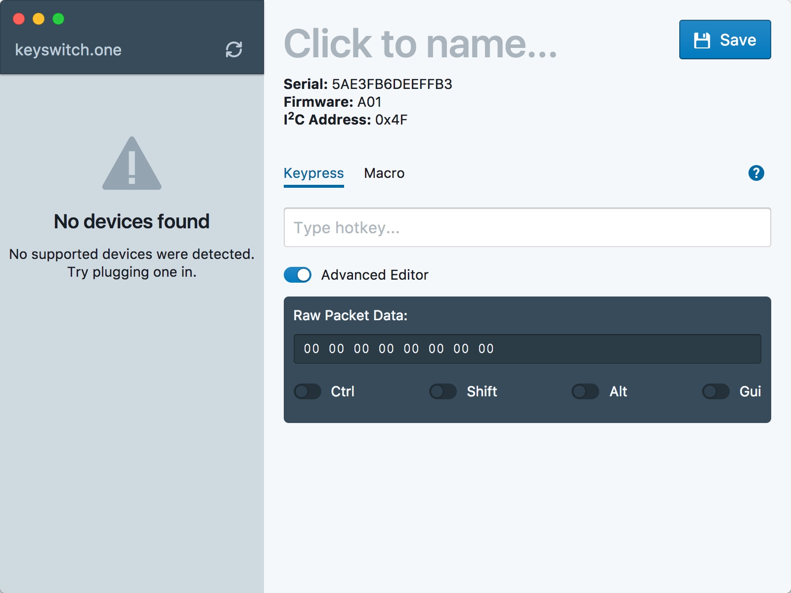

# KSO Config

The configuration utility for <keyswitch.one>. Still a work-in-progress.

## Building

1. Clone the repository.
2. `yarn install` the dependencies.
3. `electron-forge start` the application.
